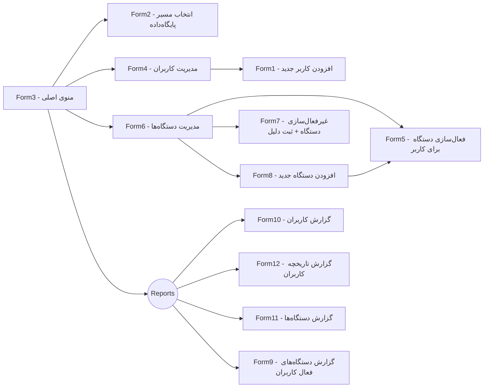

<div dir="rtl">

# Users-Assets-Managment 🚀

مدیریت کاربران و دستگاه‌ها بر اساس «کد پرسنلی» در یک پایگاه‌داده (Windows Forms / C#) 🖥️

> این پروژه یک برنامه‌ی دسکتاپ Windows Forms است که امکان تعریف و مدیریت کاربر، ثبت و مدیریت دستگاه‌ها، فعال/غیرفعال‌سازی دستگاه برای کاربران، و گزارش‌گیری‌های مختلف را فراهم می‌کند. 🧩

---

## فهرست مطالب 📚
- [نمای کلی](#نمای-کلی)
- [ویژگی‌ها](#ویژگیها)
- [جریان صفحات (فرم‌ها)](#جریان-صفحات-فرمها)
- [پیش‌نیازها](#پیشنیازها)
- [نصب و اجرا](#نصب-و-اجرا)
- [پایگاه‌داده تستی](#پایگاه‌داده-تستی)
- [ساختار پوشه‌ها](#ساختار-پوشهها)
- [نکات توسعه](#نکات-توسعه)
- [نقشه‌راه پیشنهادی](#نقشهراه-پیشنهادی)
- [مجوز](#مجوز)

---

## نمای کلی 🌟
این برنامه فرایند انتساب دستگاه‌ها به کاربران را با تکیه بر «کد پرسنلی» ساده می‌کند. با استفاده از فرم‌های مجزا برای هر عملیات (مدیریت کاربر، مدیریت دستگاه، گزارش‌گیری و …) می‌توانید چرخهٔ کامل دارایی‌ها را در سازمان مدیریت کنید.

## ویژگی‌ها ✨
- 👥 مدیریت کاربران: افزودن، ویرایش، حذف و مشاهدهٔ لیست کاربران
- ✅ اعتبارسنجی ورودی‌ها هنگام افزودن کاربر (مانند سن، صحت کد ملی و …)
- 💻 مدیریت دستگاه‌ها: افزودن دستگاه جدید، مشاهده و ویرایش لیست دستگاه‌ها
- 🔄 فعال‌سازی دستگاه برای یک کاربر و ثبت علت غیرفعال‌سازی هنگام لغو انتساب
- 📊 گزارش‌گیری:
  - 🧑‍💻 گزارش فهرست کاربران با فیلترها
  - 🕒 گزارش تاریخچهٔ کاربران
  - 🛠️ گزارش دستگاه‌ها و وضعیت آن‌ها
  - 🔍 گزارش دستگاه‌های فعال برای کاربران انتخابی

## جریان صفحات (فرم‌ها) 🗺️



## پیش‌نیازها ⚙️
- 🪟 **Windows** 10/11
- 🛠️ **Visual Studio** 2019 یا 2022 (با workload مربوط به **.NET Desktop Development**)
- 🔗 **.NET Framework** متناسب با پروژهٔ Windows Forms (پس از باز کردن فایل پروژه، نسخهٔ Target Framework را در فایل `.csproj` بررسی کنید.)
- 🗃️ **Microsoft Access (.accdb/.mdb)** به‌عنوان پایگاه‌دادهٔ پیش‌فرض پروژه (فایل دیتابیس نمونه معمولاً در `WindowsFormsApplication1\\bin\\Debug` قرار دارد).

> 💡 نکته: اگر Provider مربوط به Access (مثلاً `Microsoft.ACE.OLEDB.12.0`) روی سیستم شما نصب نیست، ممکن است نیاز به نصب **Microsoft Access Database Engine** باشد. همچنین بررسی کنید نسخهٔ .NET Framework مورد نیاز پروژه روی سیستم نصب شده باشد.

## نصب و اجرا 🏁
1. 📥 مخزن را کلون کنید:
   ```bash
   git clone https://github.com/rsdebsa/Users-Assets-Managment.git
   ```
2. 🗂️ پوشهٔ `WindowsFormsApplication1` را در Visual Studio باز کنید.
3. ▶️ پروژهٔ `WindowsFormsApplication1` را به‌عنوان **Startup Project** تنظیم کنید.
4. ⚡ **ساخت (Build)** کنید.
5. 🚀 برنامه را اجرا کنید (**Start / F5**).
6. 📝 **مرتبهٔ اول اجرا**: در فرم `Form2` مسیر پایگاه‌داده را تنظیم کنید (بخش «پایگاه‌داده تستی» را ببینید).

## پایگاه‌داده تستی 🗄️
- این پروژه از یک فایل **Microsoft Access** (فرمت `.accdb` یا قدیمی‌تر `.mdb`) به‌عنوان دیتابیس تستی استفاده می‌کند. فایل دیتابیس نمونه معمولاً در مسیر زیر قرار می‌گیرد:

```
WindowsFormsApplication1\\bin\\Debug
```

- 🖱️ در اجرای اول (فرم `Form2`) مسیر کامل فایل Access را انتخاب کنید (Browse و انتخاب فایل `.accdb`/`.mdb`).

- 🔗 **رشتهٔ اتصال (Connection String)**: در صورتی‌که لازم باشد رشتهٔ اتصال را دستی تنظیم کنید، نمونه‌های رایج به‌صورت زیر هستند:

  - Access 2007+ (`.accdb`):
    ```text
    Provider=Microsoft.ACE.OLEDB.12.0;Data Source=C:\\path\\to\\your-db.accdb;Persist Security Info=False;
    ```
  - Access 2003 (`.mdb`):
    ```text
    Provider=Microsoft.Jet.OLEDB.4.0;Data Source=C:\\path\\to\\your-db.mdb;User Id=admin;Password=;
    ```

- 🛠️ اگر ترجیح می‌دهید، رشتهٔ اتصال را در `app.config` یا فایل تنظیمات پروژه قرار دهید تا نیازی به تغییر کد نباشد.

## ساختار پوشه‌ها 📂
<div dir="ltr">

```
Users-Assets-Managment/
├─ WindowsFormsApplication1/        # پروژهٔ اصلی Windows Forms (C#)
├─ Drawing1.jpg                     # دیاگرام/طرح کلی
├─ LICENSE                          # مجوز (MIT)
└─ README.md                        # همین فایل
```

</div>

## نکات توسعه 💡
<div dir="rtl">

- 🆙 **نسخهٔ فریم‌ورک**: در فایل پروژه (`.csproj`) نسخهٔ TargetFramework را بررسی و در صورت نیاز ارتقا دهید.
- 🔗 **اتصال پایگاه‌داده**: رشته‌اتصال (connection string) را در تنظیمات پروژه پارامتریک کنید تا بتوان آن را از فایل config تغییر داد.
- 🧩 **اعتبارسنجی‌ها**: منطق اعتبارسنجی کد ملی/سن و… را در متدهای جداگانه نگه دارید تا تست‌پذیرتر شوند.
- 📝 **ثبت وقایع (Logging)**: برای ردیابی خطاها از یک کتابخانهٔ سادهٔ لاگ مانند `System.Diagnostics.Trace` یا بسته‌های سبک Third-Party استفاده کنید.
- 📈 **گزارش‌گیری**: در صورت نیاز خروجی به فرمت‌های `CSV`/`PDF` اضافه شود.

</div>

## نقشه‌راه پیشنهادی 🛤️
- [ ] 🗃️ افزودن **Migration**‌های دیتابیس یا اسکریپت ایجاد جداول برای راه‌اندازی ساده‌تر
- [ ] 🔗 انتقال Connection String به `app.config`
- [ ] 🧪 افزودن تست‌های واحد برای اعتبارسنجی‌ها
- [ ] 🔑 پشتیبانی از نقش‌ها/سطوح دسترسی (ادمین، اپراتور، مشاهده‌گر)
- [ ] 📦 بستهٔ نصب (Setup) با `ClickOnce` یا `MSIX`
- [ ] 🖼️ اسکرین‌شات از فرم‌ها در بخش «Screenshots» همین README

## مجوز 📜
انتشار تحت مجوز **MIT**. برای جزئیات، فایل `LICENSE` را ببینید.

</div>

